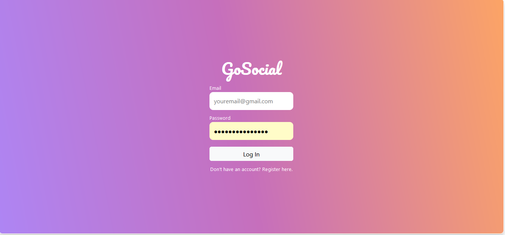

## Overview




## About the REST-API
#### UserController Documentation

The `UserController` is a RESTful controller class that handles user-related operations such as user registration, login, retrieval, update, and deletion. It interacts with a `UserRepository` to perform CRUD operations on user entities.

#### Endpoints

The following endpoints are available in the `UserController`:

#### Register User

**Endpoint:** `POST /api/users/register`

Registers a new user with the provided user details.

Request Body:
```json
{
  "fname": "John",
  "lname": "Doe",
  "email": "johndoe@example.com",
  "password": "password123"
}
```

Response:
- HTTP 201 (Created) if the user is successfully registered.
- HTTP 409 (Conflict) if a user with the same email already exists.

#### User Login

**Endpoint:** `POST /api/users/login`

Authenticates the user with the provided email and password and returns a JWT token for authentication.

Request Body:
```json
{
  "email": "johndoe@example.com",
  "password": "password123"
}
```

Response:
- HTTP 200 (OK) with the generated JWT token if the login is successful.
- HTTP 500 (Internal Server Error) with an error message if the login fails.

#### Get User by ID

**Endpoint:** `GET /api/users/{id}`

Retrieves a user by their ID.

Response:
- HTTP 200 (OK) with the user object if the user is found.
- HTTP 404 (Not Found) if no user is found with the specified ID.

#### Get All Users

**Endpoint:** `GET /api/users/allusers`

Retrieves all users.

Response:
- HTTP 200 (OK) with an array of user objects.

#### Update User

**Endpoint:** `PUT /api/users/edit/{id}`

Updates an existing user with the provided user details.

Request Body:
```json
{
  "fname": "John",
  "lname": "Doe",
  "email": "johndoe@example.com",
  "password": "newpassword123"
}
```

Response:
- HTTP 200 (OK) with the updated user object if the update is successful.
- HTTP 404 (Not Found) if no user is found with the specified ID.
- HTTP 500 (Internal Server Error) with an error message if the update fails.

#### Delete User

**Endpoint:** `DELETE /api/users/delete/{id}`

Deletes a user by their ID.

Response:
- HTTP 200 (OK) with a success message if the deletion is successful.
- HTTP 404 (Not Found) if no user is found with the specified ID.
- HTTP 500 (Internal Server Error) with an error message if the deletion fails.

#### Error Handling

The `UserController` handles various error scenarios and provides appropriate HTTP status codes and error messages.

- In case of validation errors or conflicts, relevant error messages are returned with HTTP 409 (Conflict) status.
- In case of invalid login credentials, a runtime exception is thrown with an HTTP 500 (Internal Server Error) status.
- In case of missing users or IDs, appropriate HTTP 404 (Not Found) statuses are returned.
- In case of any other unexpected errors, an HTTP 500 (Internal Server Error) status with an error message is returned.

#### Security Considerations

- The `UserController` uses the `JwtConfig` class to generate JWT tokens for user authentication.
- Cross-Origin Resource Sharing (CORS) is enabled for the `UserController` to allow requests from the `http://localhost:3000` origin.

#### Dependencies

The `UserController` relies on the following dependencies:

- `UserRepository`: Provides CRUD operations for user entities.
- `JwtConfig`: Generates JWT tokens for user authentication.

Make sure to configure and provide these dependencies before using the `UserController`.

<hr>

### Run the project
 `npm start`

Runs the app in the development mode.\
Open [http://localhost:3000](http://localhost:3000) to view it in your browser.

The page will reload when you make changes.\
You may also see any lint errors in the console.


